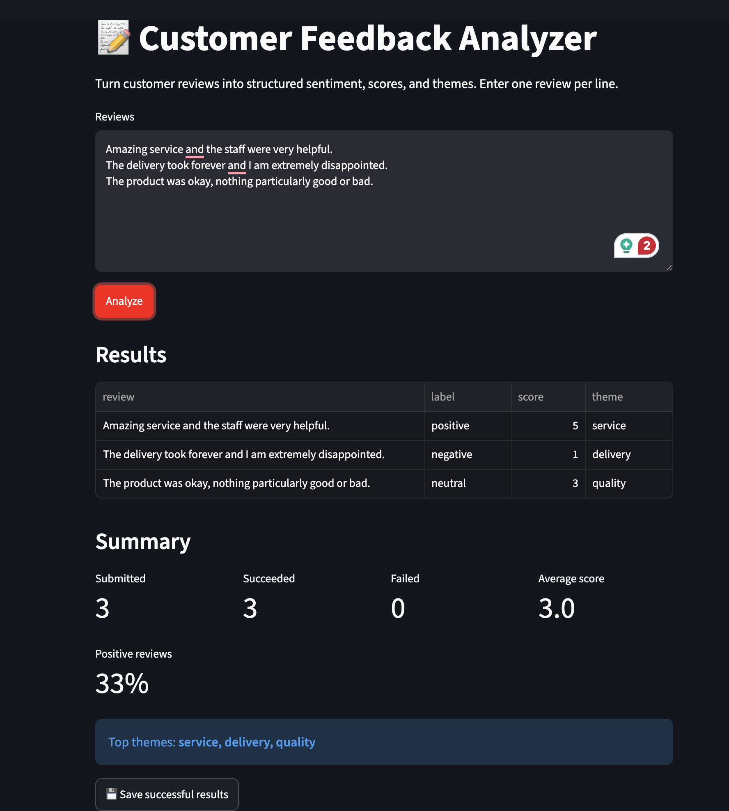

# Customer Feedback Analyzer

> Turn unstructured customer reviews into consistent sentiment, satisfaction
> scores, and topic themes through an interactive analytics dashboard.

Organizations collect valuable feedback in reviews and surveys, but reading
each response manually makes it difficult to spot recurring topics and overall
sentiment. Customer Feedback Analyzer demonstrates a practical applied AI
workflow that structures this text and summarizes successful analyses while
keeping individual results available for review.

The project combines a Streamlit dashboard, a validated FastAPI service, Google
Gemini structured output, and local SQLite storage. The architecture is kept
intentionally small while still covering UI, API, AI integration, analytics,
persistence, testing, and failure handling.

## 🚀 Live Demo

[Try the Customer Feedback Analyzer](https://customer-feedback-analyzer-748gprrueqgffnaygsoevu.streamlit.app/)

The deployed architecture is:

- Streamlit Community Cloud — frontend
- Render — FastAPI backend
- Google Gemini — AI analysis

> **Note:** The Render backend may have a cold start after inactivity, so the
> first analysis request can take longer.

## Key features

- Analyze multiple customer reviews entered one per line
- Classify each review as positive, negative, or neutral
- Assign a validated satisfaction score from 1 to 5
- Identify a one-word primary theme such as `delivery` or `service`
- Show submitted, successful, and failed review counts
- Calculate average score and positive percentage from successful reviews only
- Highlight the most common theme
- Continue processing when an individual review fails
- Save only successful results to a local SQLite database
- Browse previously saved feedback in the dashboard
- Configure the model, endpoint, timeout, credentials, and database path through
  environment variables

## Business problem

Customer feedback is usually unstructured, which creates friction for analysts
and business owners who want a quick view of satisfaction and recurring issues.
This application turns a small batch of raw reviews into a consistent table and
basic summary metrics, making exploratory feedback review faster and easier.

It is a decision-support prototype rather than a replacement for human review.
AI-generated labels can be wrong, and the current application does not claim
production accuracy or measured business impact.

## Example workflow

A restaurant owner receives these comments:

```text
The delivery arrived early and everything was still hot.
The meal was fine, but it felt expensive for the portion size.
Customer service never replied to my message.
```

The user pastes the three lines into Streamlit and selects **Analyze**. The
dashboard sends each review to FastAPI, displays Gemini's validated sentiment,
score, and theme responses, and then presents batch-level summary metrics. The
user may save the successful rows and inspect them later in saved history.

Because the application uses a generative model, exact classifications can vary
between requests.

## Architecture

```text
User
  │
  ▼
Streamlit dashboard ── POST /analyze ──► FastAPI + Pydantic validation
  │                                             │
  │                                             ▼
  │                                      Google Gemini API
  │                                             │
  ◄──────── validated sentiment, score, theme ──┘
  │
  ├── summary calculations
  └── optional save/history ──► SQLite
```

FastAPI receives one review per request. Gemini returns a structured response
that is checked against the same Pydantic model used by the API. Streamlit calls
the API once per input line, preserves partial successes, excludes failures from
metrics, and saves only valid results.

See [ARCHITECTURE.md](ARCHITECTURE.md) for component responsibilities and
failure-handling details.

## Technology stack

| Technology | Role |
| --- | --- |
| Python 3.12+ | Application language |
| Streamlit | Interactive dashboard |
| FastAPI | REST API and OpenAPI documentation |
| Pydantic | Input and structured-output validation |
| Google Gen AI SDK | Gemini integration |
| SQLite | Local review persistence |
| Requests | Dashboard-to-API HTTP client |
| pytest | Automated tests |
| uv | Dependency and environment management |

## Project structure

```text
.
├── api.py                              # Thin FastAPI entry point
├── app.py                              # Streamlit entry point
├── src/project_feedback_analyzer/
│   ├── analytics.py                    # Summary calculations
│   ├── api.py                          # FastAPI application factory/routes
│   ├── config.py                       # Environment configuration
│   ├── database.py                     # SQLite persistence
│   ├── models.py                       # Pydantic API models
│   └── service.py                      # Gemini integration
├── tests/                              # Unit and API tests
├── docs/images/                        # Screenshots
├── .env.example                        # Safe configuration template
├── ARCHITECTURE.md
├── pyproject.toml
└── uv.lock
```

## Local setup

### Prerequisites

- Python 3.12 or newer
- [uv](https://docs.astral.sh/uv/getting-started/installation/)
- A Google Gemini API key

### 1. Clone and install

```bash
git clone <your-repository-url>
cd project-feedback-analyzer
uv sync --dev
```

### 2. Configure environment variables

Copy the example file:

```bash
cp .env.example .env
```

Replace the placeholder key in `.env`:

```env
GEMINI_API_KEY=your_gemini_api_key_here
```

`.env` is excluded by `.gitignore` and must never be committed.

### Environment variables

| Variable | Required | Default | Purpose |
| --- | --- | --- | --- |
| `GEMINI_API_KEY` | Yes | None | Authenticates Gemini requests |
| `GOOGLE_API_KEY` | Alternative | None | Supported fallback credential name |
| `GEMINI_MODEL` | No | `gemini-3.6-flash` | Gemini model used by FastAPI |
| `FASTAPI_URL` | No | `http://127.0.0.1:8000/analyze` | Endpoint called by Streamlit |
| `HTTP_TIMEOUT` | No | `30` | Per-review HTTP timeout in seconds |
| `DATABASE_PATH` | No | `feedback.db` | SQLite database location |

## Run the application

The API and dashboard run in separate terminals.

### Terminal 1: FastAPI

```bash
uv run fastapi dev api.py
```

- API: `http://127.0.0.1:8000`
- Interactive documentation: `http://127.0.0.1:8000/docs`
- Health endpoint: `http://127.0.0.1:8000/health`

### Terminal 2: Streamlit

```bash
uv run streamlit run app.py
```

Open the local URL printed by Streamlit, enter one review per line, and select
**Analyze**.

## API usage

Request:

```bash
curl -X POST http://127.0.0.1:8000/analyze \
  -H "Content-Type: application/json" \
  -d '{"text":"The delivery was fast and the food was excellent."}'
```

Representative response format:

```json
{
  "label": "positive",
  "score": 5,
  "theme": "delivery"
}
```

This example illustrates the schema, not a guaranteed classification. Valid
responses enforce:

- `label`: `positive`, `negative`, or `neutral`
- `score`: integer from 1 through 5
- `theme`: one lowercase alphabetic word

Empty reviews and malformed requests receive HTTP 422. Missing Gemini
credentials receive HTTP 503, while Gemini failures or unusable provider
responses receive HTTP 502.

## Testing

Run the test suite:

```bash
uv run pytest
```

Tests cover summary calculations, API input validation, successful mocked
analysis, provider failures, missing credentials, and SQLite save/load behavior.
Gemini is mocked in API tests, so the suite does not make external AI calls or
consume API credits.

## Screenshots

### Dashboard input and results



## Limitations

- Reviews are analyzed sequentially, so large batches may be slow.
- The dashboard accepts pasted text only; it does not currently import CSV or
  spreadsheet files.
- Themes are generated per review and are not normalized across synonyms.
- SQLite is appropriate for local use, not concurrent production workloads.
- There is no authentication or multi-user separation.
- Duplicate successful results can be saved more than once.
- AI outputs can vary and should be reviewed before consequential use.
- The project does not include a measured accuracy benchmark.

## Future improvements

- Add CSV upload and downloadable results
- Normalize similar themes into a controlled taxonomy
- Add charts and time-based trends after introducing timestamps
- Support asynchronous or batched analysis for larger datasets
- Add database migrations before evolving the persisted schema
- Create an evaluation dataset for sentiment and theme quality
- Add authentication and a production-ready data store for multi-user use
